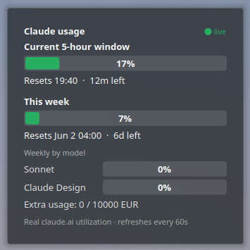

# Claude Quota — KDE Plasma widget

A panel/desktop widget for KDE Plasma that tracks your **Claude usage** — both the
rolling **5-hour window** and the **weekly** limit — at a glance.

It has two data sources:

- **online** — your *real* claude.ai utilization percentages (the same numbers
  shown on the claude.ai *Settings → Usage* page and by Claude Code's `/usage`).
- **local** — an offline estimate computed from your local Claude Code
  transcripts via [`ccusage`](https://github.com/ryoppippi/ccusage). Always works,
  no credentials, but it's a *proxy* (see [How it works](#how-it-works)).



---

## Features

- **Two bars:** current 5-hour window + this week, colour-coded (green → amber → red).
- **Online mode** shows true percentages, real reset times, per-model weekly bars
  (e.g. Sonnet, Claude Design) and your overage-credit balance.
- **Local mode** shows token counts, cost, burn rate, and a **projection / ETA-to-limit
  early warning** ("⚠ cap in ~22m") so you know *before* you get throttled.
- **`auto` mode:** use online when available, fall back to local automatically.
- Compact panel view (just the session %) that expands to the full card.
- Everything configurable from the widget's own settings dialog.

## Requirements

- **KDE Plasma 5** (built and tested on 5.27; Plasma 6 would need minor QML import changes).
- `bash`, `curl`, `node`, `jq` — standard on most Linux desktops.
- For **local** mode: [`ccusage`](https://github.com/ryoppippi/ccusage). No install
  needed if you have `npx` (it's fetched on demand); for speed, `npm i -g ccusage`.
- For **online** mode: [Claude Code](https://claude.com/claude-code) logged in on the
  same machine (the widget reuses its login token — see [Online mode](#online-mode)).

## Install

### One-liner (always the latest)

```bash
curl -L https://github.com/DdeDamian/claude-quota-widget/releases/latest/download/claude-quota.plasmoid -o /tmp/claude-quota.plasmoid \
  && kpackagetool5 --type Plasma/Applet --install /tmp/claude-quota.plasmoid
```

`claude-quota.plasmoid` is a stable, version-less asset on every release, so that URL
always points at the newest build. To upgrade later, swap `--install` for `--upgrade`.

### From a release (manual)

Download `claude-quota.plasmoid` (or the versioned `claude-quota-X.Y.plasmoid`) from the
[Releases](../../releases) page, then either:

```bash
kpackagetool5 --type Plasma/Applet --install claude-quota.plasmoid
```

…or in the GUI: right-click panel/desktop → **Add Widgets** → **Get New Widgets** →
**Install Widget From Local File…** → pick the `.plasmoid` (on most setups you can also
just double-click the file).

### From source

```bash
git clone https://github.com/DdeDamian/claude-quota-widget.git
cd claude-quota-widget
./install.sh
```

Then add it: right-click your panel or desktop → **Add Widgets** → search **"Claude Quota"**.

## Configuration

Right-click the widget → **Configure Claude Quota**.

**General**
- **Data source** — `local`, `online`, or `auto` (default).
- **Refresh interval** — seconds between updates (default 60).
- **5h / Weekly limit** — token caps used as the % denominators in *local* mode.
  Leave `0` to auto-size against the p90 of your history.

**Online data**
- Nothing required — online mode reuses your Claude Code login token automatically.
- *Override (optional):* a pasted Bearer token (must have the `user:profile` scope).

## Modes

### Online mode

Online mode calls Claude's internal usage endpoint:

```
GET https://api.anthropic.com/api/oauth/usage
    Authorization:     Bearer <token>
    anthropic-beta:    oauth-2025-04-20
    anthropic-version: 2023-06-01
```

The `<token>` is read from your local Claude Code credentials
(`~/.claude/.credentials.json` → `claudeAiOauth.accessToken`). That token carries the
`user:profile` scope the endpoint requires and is auto-refreshed by Claude Code as you
use it. The response is the real utilization, e.g.:

```json
{
  "five_hour": { "utilization": 16.0, "resets_at": "…T17:40:00Z" },
  "seven_day": { "utilization":  7.0, "resets_at": "…T02:00:00Z" },
  "seven_day_sonnet":   { "utilization": 0.0 },
  "seven_day_omelette": { "utilization": 0.0 },
  "extra_usage": { "is_enabled": true, "monthly_limit": 10000, "used_credits": 0.0, "currency": "EUR" }
}
```

Auth: a pasted Bearer token override if you set one, otherwise the Claude Code login
token. If neither works, `auto` falls back to local.

> **Note:** `claude setup-token` tokens are *inference-scoped* and lack `user:profile`,
> so they are rejected (403) by this endpoint. Use the Claude Code login token (the default).

### Local mode

Local mode runs `ccusage` over `~/.claude/projects/**/*.jsonl` — the transcripts Claude
Code writes as you work, each of which records its own token usage. It sums those and
buckets them into the 5-hour and weekly windows.

Because the local data has no notion of your account's real limit, the **percentage is a
proxy**: it's your token total divided by a denominator. By default that denominator is
the **p90 of your historical windows** (robust against one-off huge sessions); you can
set an explicit cap in Configure once you learn where you actually hit limits.

The raw `ccusage` scan is cached for 30s to avoid re-reading your transcripts every tick.

## Privacy & security

- **Local mode is fully offline** — it only reads files on your machine and makes no
  network calls (pricing uses `ccusage`'s bundled `--offline` table).
- **Online mode** reads your Claude Code login token from `~/.claude/.credentials.json`
  on each refresh and sends it **only** to `api.anthropic.com` over HTTPS — the same
  place Claude Code itself sends it. The token is never logged, printed, or sent anywhere
  else. Credentials entered in the config dialog are stored in plain text in your local
  plasma config, same as any other widget setting.

## Building

```bash
./build.sh        # produces claude-quota-<version>.plasmoid
```

CI (`.github/workflows/build.yml`) validates the package and builds the `.plasmoid` on
every PR; pushing a `vX.Y` tag also attaches the built `.plasmoid` to a GitHub release.

## Layout

```
package/
  metadata.json              # plasmoid manifest
  contents/
    ui/main.qml              # the widget (compact + full views)
    ui/configGeneral.qml     # Configure → General page
    ui/configOnline.qml      # Configure → Online data page
    config/config.qml        # config category registration
    config/main.xml          # config keys + defaults
    scripts/claude-quota-json# data-source: emits the JSON the widget renders
```

The QML never talks to the network itself — it just runs the bundled script on an
interval and renders the JSON it prints.

## Disclaimer

This is an **unofficial** tool, not affiliated with or endorsed by Anthropic. The online
endpoint (`/api/oauth/usage`) is **undocumented** and reverse-engineered from Claude Code;
it can change or break at any time, in which case `auto` mode keeps working via the local
estimate. Use it for your own account only.

## License

[MIT](LICENSE)
